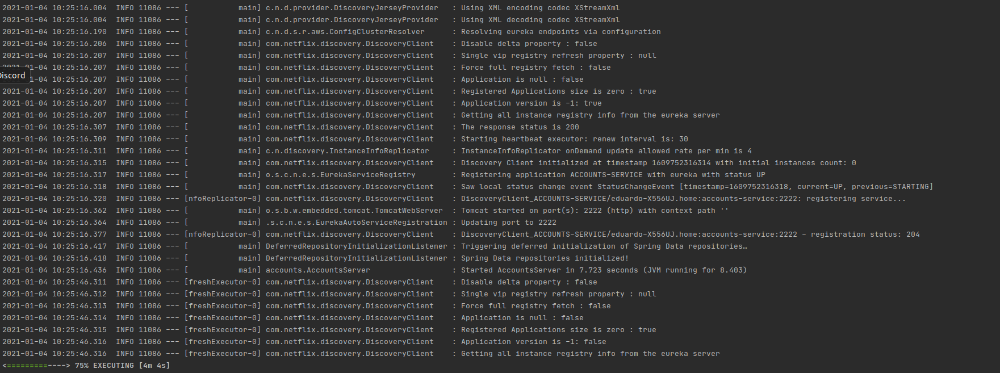
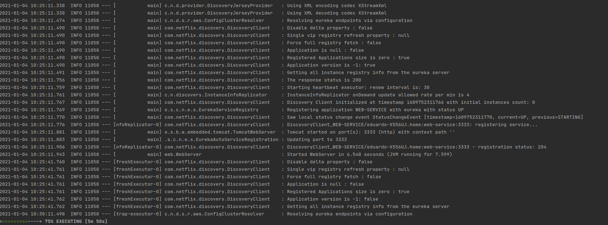
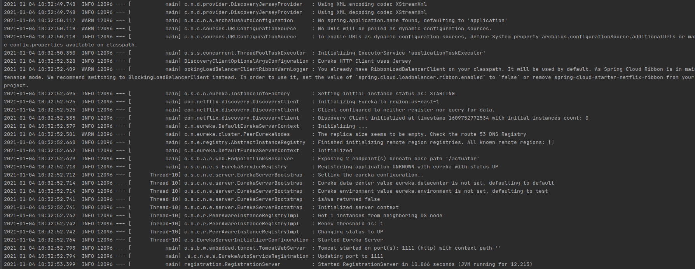
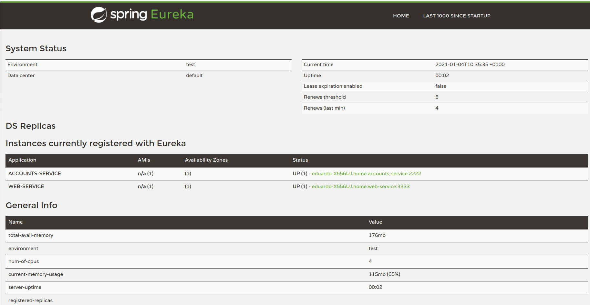
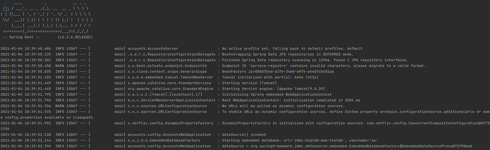
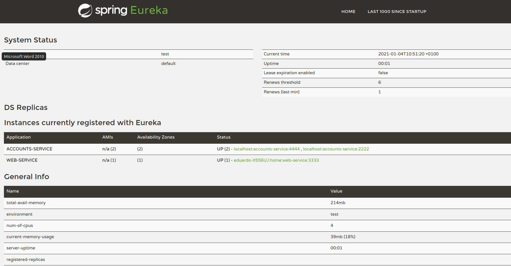
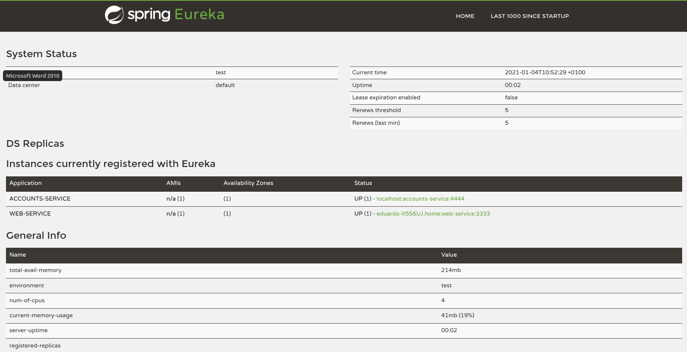

## The two microservices accounts (2222) and web are running and registered (two terminals, logs screenshots).

Account service running on port 2222 and registry in Eureka server

Web service running on port 3333 and registry in Eureka server

## The service registration service has these two microservices registered (a third terminal, dashboard screenshots)
Registration running on port 1111 with 2 services registry

    
Dashboard of Eureka showing the service register

  
## A second accounts microservice instance is started and will use the port 4444. This second accounts (4444) is also registered (a fourth terminal, log screenshots).
    
Account service running on port 4444

Dashboard showing the registration of the new account service

  
## What happens when you kill the microservice accounts (2222) and do requests to web? Can the web service provide information about the accounts and why?
When we kill the microservice Eureka server detect that the server isn't alive and remove the server from the list of service. In that case Eureka has another server registered that give the same service for that reason we can provide information about the accounts with that server. In the next image we can see the state of the dashboard of Eureka when account (2222) is dead.
